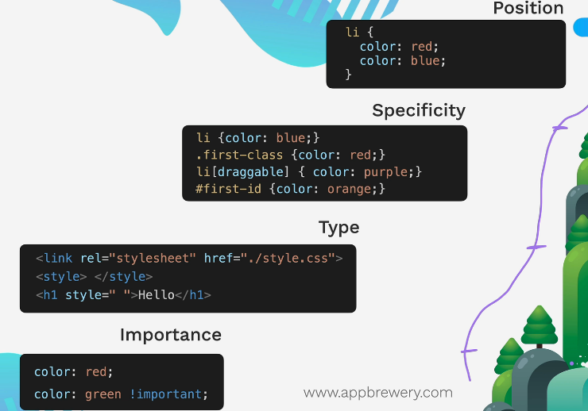
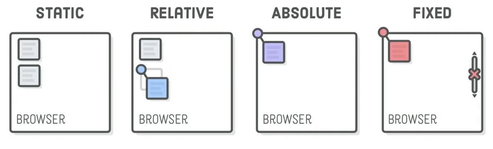

# CSS

CSS is Cascading Style sheet where you start from the general and go on more focussed.
There are other Style sheets also like SCSS , Less , etc

Syntax:

Selector{
property : value
}

## Types of adding CSS

1. Inline = Targeting only single Html tag. |`<h1 style="color: blue;">Style Me in Blue!</h1>`
2. Internal = targeting only single HTML file. | inside head ->   `<style>h1{color: red;}`
3. External = Targeting multiple HTML file. | inside head -> `<link rel="stylesheet" href="./style.css">`

## CSS Selector

class and id goes into tags. classes can have multiple tags selected in html file. On the other hand the id has to be uniqure per document.
1. . dot is used to select class. 
2. \# is used to select id.
3. \* universal selector
4. tag[..] this selector selects tags with some attribute set.
5. We can combine the selector also, e.g. - `.class p { } `
6. Group Selector e.g. - selector1,selector2 { }
7. selector > selector - the first one is parent and the second one is child. This should be direct child.
8. Descendant Selector - selector selector{} - the left is ancestor and the right one is descendant. This applies style to descandent of the left side.
9. Chaining - selectorselector{ }
10. Combining Combiners - Combining the above.

## Font Properties

### Font size
1. px
2. pt
3. 1em = 100% of parent
4. 1rem = 100% of root

### Font Weight
1. normal bold
2. lighter | bolder
3. number 100-900

### Font family
1. font-family : "Times New Roman"

### Text Align
1. center
2. left | right
3. start | end

### Box Model
content < padding < border < margin
div is used to create your own boxes to separate out the stuff

### CSS Specficity and Inheritance
These are also in terms of order of importance
1. Position - The last line will be taken 
2. Specificty - element selector<class<attribute<id
3. Type - External CSS < Internal < Inline
4. Important - !important; this keyword overrides everything.




### CSS Position
1. Relative - relative to ITS default posiiton
2. Absolute - relative to its closest ancestor. If its not there it uses the document body.
3. Fixed - remains at the location even if the scrolling is done.
4. Static Positioining - default. This property prevents top, left ... to do its job.

If parent is made relative then if you do position absolute in child then its position is done relative to parent.



z-index - the higher value overlays on the other. Default 0.

### Display Properties
1. Inline - Same Line default to content length. With inline you cant set its width and height
2. Block - Entire full width
3. Inline-Block - You can set height and width of the block and they will go inline.
4. None - Disappears the element
5. float - it can take two values - left and right. applies to an element and other elements just wrap around it. If you dont want to wrap the other element use `clear`.
Use it to just wrap text aroung images. We have better Techniques like flext,grid to achieve the same.

Remember float makes things behave like inline-block.

### Create Responsive websites
This Section is under 8.2
1. Media Query
2. CSS Grid
3. CSS Flexbox
4. External Framework e.g. Bootstrap


#### 1. Media Queries

    @media (max-width: 600px) {

      /* CSS for screens below or equal to 600px wide */
      div {
        height: 200px;
        width: 200px;
      }
    }

max-width -  will target the area which are less than 600px
min-width -  will target the area greater than 600px.


#### 2. CSS Flexbox

When using Flex all the default setting of tag elements(e.g. div is block, img is inline) conerted into inline where each elements go side by side and all elements comes under big block flex container.
`display : flex`
When using
`display : inline-flex` -  the flex container items takes that much which is required.

The below properties are applied to the parent container
```
display:flex;
flex-direction : row(default) 
flex-wrap : nowrap(default)
justify-content : flex-start | center | space-between
align-items : flex-start | center | -- works on the container  and set the items accordingly . you can set now height of the container ->height :70vh
align-contents : flex-start  | center | - works when flex-wrap is set to wrap. align-items does not becomes useful
```
The below are applied to the items. This changes the height of the flex items
```
flex-basics:100px 
align-self : flex-start - setting on particular items
order : 10|1 | default 0 basically ordering of the contents in the container
```
[Flex box play](https://appbrewery.github.io/flex-layout/)

[CSS Flexbox Guide](https://css-tricks.com/snippets/css/a-guide-to-flexbox/)

[CSS Flexbox Game](https://appbrewery.github.io/flexboxfroggy/)

##### Flex Sizing
The flexbox we know puts the items in container. But the amount size given to the items is determined the priorirty list given below:
content width < width < flex-basis < min-width/max-width.

max-width looks at longest line in the paragraph. min-width looks at longest word in the sentence.

Default behaviour
flex-basis : auto | flex basis is the initial starting point
flex-grow : 0
flex-shrink : 1

Shorthand of above three
flex: 1 1 0 (grow , shrink , basis) or simply flex : 1 


#### Grid

While Flexbox is for 1D Grid is for 2D layouts more like you want a tabular struture.

[Grid Vs Flexbox](https://appbrewery.github.io/grid-vs-flexbox/)

[Grid Sizing](https://appbrewery.github.io/grid-sizing/)

grid-template-rows: 100px auto;  -> Here only content size for the second row
grid-template-columns: 200px auto; -> for the second column complete space available.
This is some difference when using auto keyword.

[Grid Garden Game](https://appbrewery.github.io/gridgarden/)


#### Bootstrap

1. Follows 12 columns layout
2. https://getbootstrap.com/docs/5.3/layout/breakpoints/#available-breakpoints - this link has the bootstrap responsive design.
    e.g. col-xl-6 is set to div class. then this means as long as you are greater than 1200px you will occupy 50% of the screen.


#### 4 principles of web design
1. Color theory
2. Typography (serif, sans-serif)
3. UI interface
4. User Experience Design